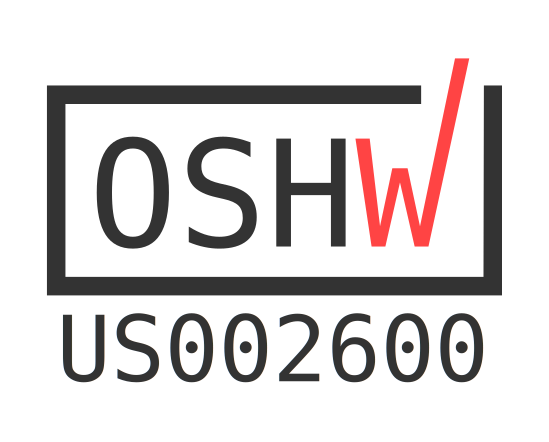
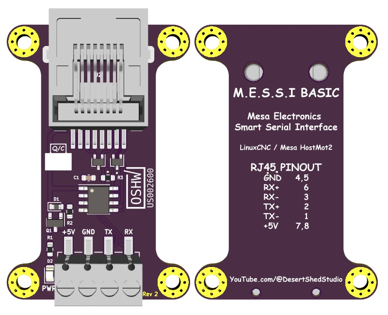

M.E.S.S.I Basic
============

The "M.E.S.S.I Basic" is an open source OSHWA Certified hardware design, implementing a RS-422 interface for use with Mesa Ethernet Anything 
I/O Cards and Mesa Electronics smart serial daughter cards.

M.E.S.S.I  
"Mesa Electronics Smart Serial Interface"

This repository is aimed towards those who wish to manufacture their own boards. 

Board Rendering
============

License
=======

M.E.S.S.I Basic | https://github.com/DesertShedStudio/M.E.S.S.I-Basic  
Copyright (c) Desert Shed Studio

This source describes Open Hardware and is licensed under the CERN-OHL-S v2.

You may redistribute and modify this source and make products using it under  
the terms of the CERN-OHL-S v2 (https://ohwr.org/cern_ohl_s_v2.txt).  

This source is distributed WITHOUT ANY EXPRESS OR IMPLIED WARRANTY,  
INCLUDING OF MERCHANTABILITY, SATISFACTORY QUALITY AND FITNESS FOR A  
PARTICULAR PURPOSE. Please see the CERN-OHL-S v2 for applicable conditions.
